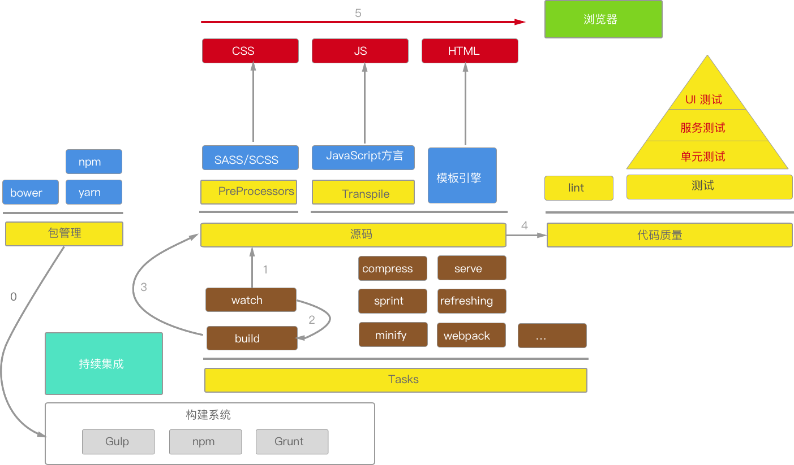

# 构建系统：资深分界线

Yeoman 生成脚手架，并且现在的主流前端框架都提供了相似的工

打包 -> 压缩 -> 上传 -> 解压 -> 替换 -> 重启

重点在于：提高工作效率

## 为什么构建很重要

过去我们打开编辑器、浏览器、修改代码、刷新页面，如下图所示：


这个过程仍然没有发生太大的变化，只是很多的步骤都被自动化了：

我们只需要修改代码，诸如 watchman 这样的工具就检测到修改，而 Browsersync 则可以帮助我们自动刷新页面。

## 构建工具

取决于你所使用的技术栈

SASS、SCSS 因不同的情况而异

webpack

npm

grunt / gulp

## 构建流程



LiveReload

Bower

concat -> init -> lint -> min -> qunit -> server -> test -> watch

### 构建示例

如下是混合应用框架 Ionic 执行 ``ionic serve`` 时的启动日志：

```
[11:43:58]  ionic-app-scripts 1.3.4
[11:43:58]  watch started ...
[11:43:58]  build dev started ...
[11:43:58]  clean started ...
[11:43:58]  clean finished in 1 ms
[11:43:58]  copy started ...
[11:43:58]  transpile started ...
[11:44:03]  transpile finished in 5.17 s
[11:44:03]  preprocess started ...
[11:44:03]  deeplinks started ...
[11:44:03]  deeplinks finished in 132 ms
[11:44:03]  preprocess finished in 132 ms
[11:44:03]  webpack started ...
[11:44:03]  copy finished in 5.49 s
[11:44:26]  webpack finished in 22.94 s
[11:44:26]  sass started ...
[11:44:29]  sass finished in 3.21 s
[11:44:29]  postprocess started ...
[11:44:29]  postprocess finished in 85 ms
[11:44:29]  lint started ...
[11:44:29]  build dev finished in 31.57 s
[11:44:29]  watch ready in 31.69 s
```

这个过程中，它会完成如下的步骤：

watch -> build dev -> clean -> copy -> transpile -> preprocess (deeplinks) -> webpack (copy) -> sass -> postprocess -> build dev 

### 自动刷新

### 转译

### 预处理

