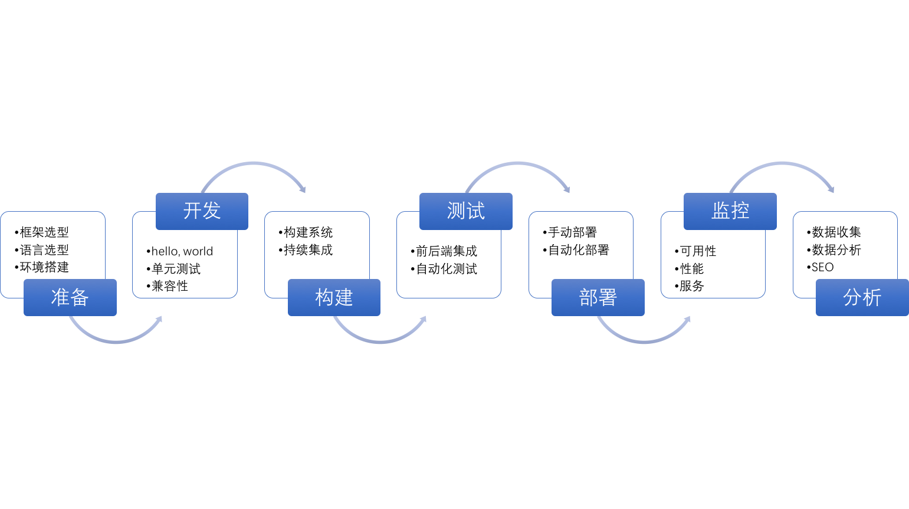
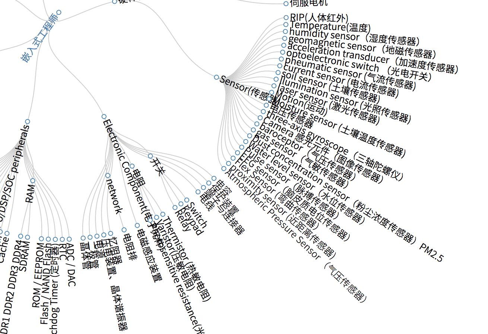
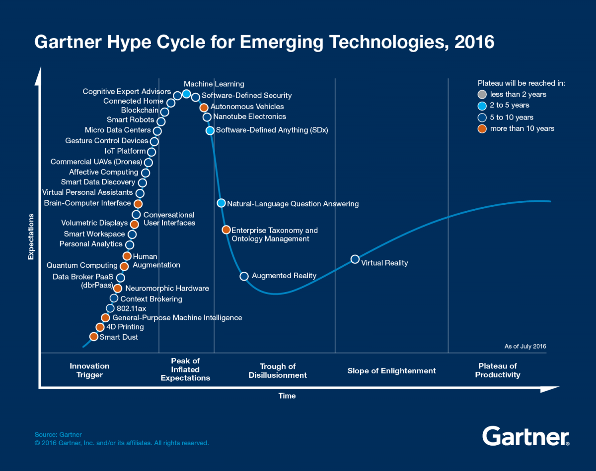

# 前端进阶

## 什么是前端

作为一本前端进阶的书，没有理由去强调一下**什么是前端**？可是，当你说前端的时候，我也说前端的时候，我们说的是同一个前端吗？

我理解下的前端，指广泛意义上的前端。又可以称为『客户端』，泛指：与用户做交互的应用。如桌面浏览器上的浏览器、图形用户界面，移动设备上的应用程序、浏览器，又或者是各种智能、联网设备的交互都可以归属于前端。

因而，在这种意义上来说，前端要做的不仅仅是 Web，还可以是混合应用，原生应用等等。

这就意味着：

 - 你可以使用 CSS Layout +  React Native 编写移动程序
 - 你可以使用 Electron 来编写桌面应用
 - 你可以使用 React VR 来编写 VR 应用
 - 等等

这种时候，前端指的是，我们使用 **样式（类CSS） + 类JavaScript + 模板（HTML、XML等** 编写的应用。

如果那些用 JavaScript 编写的应用，也划分到前端的范畴，那么：

 - 你还可以使用 JavaScript 与 Ruff、 Tessel 对硬件进行编程
 - 你还可以使用 Node.js 来编写后台应用，又或者是 BFF （backend for frontend）层

在这里，我们将前端定义为 类CSS + 类 JavaScript + 模板。因为没有图形应用的应用，难以直观的与用户进行交互，做不了『客户端』应用。在这一定义下，这一类型的应用有，桌面应用、桌面网页、移动网页、移动应用等等，现在发展的有 VR 技术等等。

## 本书内容


# 硬技能篇

# 前端知识要点

罗列一下，一些必要的知识点


希望读者都是知道的，以便于

作为一个领域，它拥有相当多的知识点。

如果读者已经知道了这些，那么可以跳过这一章的内容。

## 前端应用的生命周期



### 入门

在我理解下的基础知识，就是我们可以写一些基本的样式，并能对页面的元素进行操作。举例来说，就是我们用Spring和JSP写了一个博客，然后我们可以用jQuery来对页面进行一些简单的操作，并可以调用一些API。因此，我们需要基本的HTML / CSS知识。只是要写好CSS并不是一件简单的事，这需要很多实战经验。随后，我们还需要有JavaScript的经验，要不怎么做前端呢？

同时，我们还需要对DOM有一些基础的了解，才能做一些基本的操作，如修改颜色等等。在这种情况下，最简单的方案就是使用jQuery这样的工具。不过，如果可以自己操作DOM是再好不过的了。

### 中级篇 

中级篇就更有意思了，现在我们就需要对页面进行更复杂的操作。Ajax和JSON这两个技能是必须的，当我们要动态的改变页面的元素时，我们就需要从远程获取最新的数据结果。并且我们也需要提交表单到服务器，RESTful就是必须要学会的技能。未来我们还需要Fetch API，ReactiveX这些技能。

除此我们还需要掌握好HTML的语义化，像DIV / CSS这也会必须会的技能，我们应该还会使用模板引擎和SCSS / SASS。而这个层面来说，我们开始使用Node.js来完成前端的构建等等的一系列动作，这时候必须学会使用命令行这类工具。并且，在这时候我们已经开始构建单页面应用了。

### 高级篇

JavaScript是一门易上手的语言，也充满了相当多的糟粕的用法。几年前人们使用CoffeeScript编成成JavaScript来编写更好的前端代码，现在人们有了ES6、TypeScript和WebPack来做这些事。尽管现在浏览器支持不完善，但是他们是未来。同样的还有某些CSS3的特性，其对于某些浏览器来说也是不支持的。而这些都是基于语言本来说的，要写好代码，我们还需要掌握面向对象编程、函数式编程、MVC / MVVM / MV*这些概念。作为一合格的工程师，我们还需要把握好安全性（如跨域），做好 授权（如HTTP Basic、JWT等等）。

### 工程化

这个标题好像是放错了，这部分的内容主要都是自动构建的内容。首先，我们需要有基本的构建工具，无论你是使用gulp、grunt，还是只使用npm，这都不重要。重要的是，你可以自动化的完成构建的工具，编译、静态代码分析（JSLint、CSS Lint、TSLint）、对代码质量进行分析（如Code Climate，可以帮你检测出代码中的Bad Smell）、运行代码中的测试，并生成测试覆盖率的报告等等。这一切都需要你有一个自动构建的工作流。

### 兼容性

虽然我们离兼容IE6的时代已越来越远了，但是我们仍然有相当多的兼容性工作要做。基本的兼容性测试就是跨浏览器的测试，即Chrome，IE，Firefox，Safari等等。除此还有在不同的操作系统上对同一浏览器的测试，某些情况下可能表现不一致。如不同操作系统的字体大小，可能会导致一些细微的问题。而随着移动设备的流行，我们还需要考虑下不同Android版本下的浏览器内核的表现不致，有时候还要一下不成器的Windows Phone。除此，还有同一个浏览器的不同版本问题，常见于IE。。

### 前端特定

除了正常的编码之外，前端还有一些比较有意思的东西，如CSS3和JavaScript动画。使用Web字体，可惜这个不太适合汉字使用。还有Icon字体，毕竟这种字体是矢量的。不过Icon字体还有一些问题，如浏览器对其的抗锯齿优化，还有一个痛是你得准备四种不同类型的字体文件。因此，产生了一种东西SVG Sprite，在以前这就是CSS Sprite，只是CSS Sprite不能缩放。最后，我们还需要掌握一些基本的图形和图表框架的使用。

### 软件工程

这一点上和大部分语言的项目一样，我们需要使用版本管理软件，如git、svn，又或者是一些内部的工具。总之你肯定要有一个，而不是 2016.07.31.zip这种文件。然后，你还需要一些依赖管理工具，对于那些使用Webpack、Browserify来将代码编写成前端代码的项目来说，npm还是挺好用的。不过就个人来说，对于传统的项目来说我总觉得bower有些难用。我们还需要模块化我们的源码文件，才能使其他人更容易开始项目。

### 调试
 
 作为一个工程师来说，调试是必备的技能。大部分浏览器都自带有调试工具，他们都不错——如果你使用过的话。在调试的过程中，直接用Console就可以输出值、计算值等等。如果你的项目在构建的过程中有一些问题，你就需要debugger这一行代码了。在一些调用远程API的项目里，我们还需要一些更复杂的工具，即抓包工具。在调试移动设备时，像Wireshark、Charles这一类的工具，就可以让我们看到是否有一些异常的请求。当然在这个时候，还有一个不错的工具就是像Chrome自带的远程设备调试。对于移动网站来说，还要有Responsive视图。
 
### 测试

我遇到的很多前端工程师都是不写测试的，于是我便把它单独地抽了出现。对于一个前端项目来说，正常情况下，我们要有单元测试、功能测试，还有要一些UI测试来验证页面间是否可以跳转。对于依赖于第三方服务的应用来说，还要有一个Mock的服务来方便我们测试。如果是前后端分离的项目，我们还需要有集成测试。

### 性能与优化

要对Web应用进行性能优化，可能不是一件容易的事，有时候我们还知道哪些地方可以优化。这时候人们就可以使用Yahoo的YSlow，或者我最喜欢的Google PageSpeed来检测页面的一些问题，如有没有开启GZip、有没有压缩、合并、Minify JS代码等等。我们还应该借助于NetWork这一类的工具，查看页面加载时，一些比较漫的资源文件，并对其进行优化。在一些情况下，我们还需要借助如Chrome的Timline、Profiel等工具来查看可以优化的地方。

### 设计

前端工程师还需要具备基本的UI技能。多数情况下拿到的只是一张图，如果是一个完整的页面，我们就需要快速分割页面布局。而依赖于不同的页面布局，如响应式、网格、FlexBox布局也会有不同的设计。而有些时候，我们就需要自己规划，制作一个基本的线框图（Wireframe）等等。

### SEO

如果以搜索引擎作为流量来源，我们还需要考虑页面的内容，除非你用的是竞争排名。像Sitemap可能就不是我们考虑的内容，而我们还要考虑很多点。首先，我们需要保证页面的内容是对于搜索引擎是可见的，并且对应的页面还要有基本的Title、Description和Keyword。然后在一些关键的字体，如栏目标题等等可以用H2之类的大字的地方就不要放过。同时在页面设计的过程中，我们还需要考虑一些内部链接的建设。它即可以提供页面的可见度，又可以提高排名。最后，如果你是面向的是Google等支持结构化数据的搜索引擎，你还需要考虑一下MicroData / MicroFormat这一类东西。

# 快速学习新的框架

今天很流行的 Web 框架，半年以后，可能就会在市场上被『淘汰』——技术选型的时候，不被开发人员推荐；又或者它已经推出了全新的版本，使用了全新的 API，我们便需要更新现有应用。

前端框架丰富多彩的今天，快速学习新的框架，几乎是每个前端程序员的必备技能。

## 快速学习是基本能力

后端程序员，开始一个新的 Web 项目时：

 - 使用 Java 语言，八成会选用 Spring 框架。
 - 使用 Ruby 语言，八成会选用 Rails 框架。
 - 使用 Scala 语言，八成会先用 Play 框架。

而只使用 JavaScript 的前端程序员，开始一个前端项目时。你有几成的把握，能判断他/她出会使用哪个框架？

后端程序员在有限的时间内，只会使用固定的技术栈，固定的框架。对于大部分的公司来说，使用相同的后台语言，是一个更好的选择——即可以减少带成本，又可以沉淀下技术积累。

而前端则不一样，不同的项目都有各自的需求，因此采用使用不同的技术栈。简单的，可以直接使用原生的 JavaScript 完成，又或者是使用 jQuery 完成开发。稍微复杂一点的项目，采用容易上手的 Vue.js 是一个不错的选择。更复杂的项目，便可以使用 Angular，可以方便后台程序员转到前端。

因此，工作一定年限的程序员，都使用过不同的框架。可是，不同的程序员上手新框架的速度，总会存在一定的差异。

那么，怎样才能快速上手一个新的框架呢？

学习新的前端框架，要么该框架很火——即**热闹驱动开发**（Hype Driven Development，HDD），要么你们将采用该框架。在采用新框架的动机里，有一种是：技术演进。使用新的技术、框架，来替换现有的框架。旧的框架在某些地方上，存在着明显的缺陷。

这种情形下，业务知识本身是不变的，只是要由框架本身来应对业务的变化。因此，使用新的技术来替换旧有的框架，就相当的容易——重写，我们甚至可以直接复制、粘贴，大量原有的代码。只是，仅仅做到重写业务逻辑是不够的。我们还要掌握新的框架的核心，并探索更多的可能性。

### 如何学习新框架：守-破-离

对于我而言，学习一个新框架的姿势是：

 - 买本中文书或者找个教程、官方的 Guide，花个十几分钟了解一下框架的『知识图谱』。
 - 直接找个官方的示例，运行一下 Demo。
 - 上手写写应用。
 - 查看官方文档，看看自己是不是漏掉了什么重要的东西。

它与我在公司接受培训的时候，学习到的『守破离』观点相似。

### 守：应用业务知识

在现有的业务上，使用新的框架是一件容易的事。拿上一份框架的说明书、一份需求文档、一个搜索引擎，就可以很容易地复制出一个产品。唯一的门槛是，你需要会读懂这些内容。这有点像新的知识阶级，只是门槛不再是识字与否，而在于是否能懂编程的知识。

正如维基百科上，对于『守』的介绍一样：

> 最初阶段须遵从老师教诲，认真练习基础，达到熟练的境界。

新手期的我们，拿到一个新的框架，要一下子对它了运用自如，是一件很难的事。我们只能在一个又一个的练习中，尝试去掌握框架的知识。

采用一个模板，GitHub 上寻找，这样的项目很多。

举例，如 Backbone + jQuery -> Vue.js

### 破：学习框架核心

> 基础熟练后，试着突破原有规范让自己得到更高层次的进化。

转换技术栈，本身没有什么技术含量，但是能帮助稳固知识。当我们已经熟悉使用这个框架完成业务时，便可以细入相关思想。

了解这个框架的能力，生成一份与框架有关的索引，也可以用脑图的形势来整理这些内容。

如：



举例，如 Angular + TypeScript，还有其他更多的可能性

### 离：探索更多可能性

> 在更高层次得到新的认识并总结，自创新招数另辟出新境界。

在那之上，创造出一些新的框架。

如 Redux，最早是运行的 React.js 之上。Angular 2 出来了后，有了 xx。小程序出来后，有了 xx。

同理于此，

## 选择合适的前端框架


## 小结

寻找心流

这些方法适用于大部分的人，但是不一定适合你。你只需要寻找到适合你的路，然后学习。


# 构建系统：资深分界线

Yeoman 生成脚手架

打包 -> 压缩 -> 上传 -> 解压 -> 替换 -> 重启

## 为什么构建很重要


## 构建工具

取决于你所使用的技术栈

SASS、SCSS 因不同的情况而异

webpack

npm

grunt / gulp

## 构建流程


LiveReload

Bower

concat -> init -> lint -> min -> qunit -> server -> test -> watch

### 构建示例

如下是混合应用框架 Ionic 执行 ``ionic serve`` 时的启动日志：

```
[11:43:58]  ionic-app-scripts 1.3.4
[11:43:58]  watch started ...
[11:43:58]  build dev started ...
[11:43:58]  clean started ...
[11:43:58]  clean finished in 1 ms
[11:43:58]  copy started ...
[11:43:58]  transpile started ...
[11:44:03]  transpile finished in 5.17 s
[11:44:03]  preprocess started ...
[11:44:03]  deeplinks started ...
[11:44:03]  deeplinks finished in 132 ms
[11:44:03]  preprocess finished in 132 ms
[11:44:03]  webpack started ...
[11:44:03]  copy finished in 5.49 s
[11:44:26]  webpack finished in 22.94 s
[11:44:26]  sass started ...
[11:44:29]  sass finished in 3.21 s
[11:44:29]  postprocess started ...
[11:44:29]  postprocess finished in 85 ms
[11:44:29]  lint started ...
[11:44:29]  build dev finished in 31.57 s
[11:44:29]  watch ready in 31.69 s
```

这个过程中，它会完成如下的步骤：

watch -> build dev -> clean -> copy -> transpile -> preprocess (deeplinks) -> webpack (copy) -> sass -> postprocess -> build dev 

### 自动刷新

### 转译

### 预处理

##

# 什么是前端的架构能力

> 远离最佳实践，除非你能接受其带来的成本

当我们谈及『前端的架构』时，我们讨论的是复杂前端应用的架构——如果只是一个 jQuery + Bootstrap 完成的应用，那么它的架构想必是『散弹式』的应用，没有复杂的逻辑可言。

## “标准”的 SPA 构架实践

复杂的前端应用，多数是 SPA（单页面应用），这就意味着系统的架构是前后端分离的。可前后端分离并意味着，

### 前后端分离

### 无状态 API

## workflow

### 前后端分离的工作方式

## 风格指南：StyleGuide

与之前的构建系统相比，StyleGuide 便是一种无法用工具强制执行的规范。尽管可以采用工具来做类似的事情，但是并非应该强制去做。

 - 代码规范
 - 函数限制。Java -> 30 行

## 演进

当前技术栈，未来技术栈，切换。

使用了 Backbone，性能上出现一些瓶颈。

是不是要重写服务。

后台不能满足一些需求，考虑使用 BFF 吗

选用合适的策略，并保证没有问题。


## 最佳实践：框架

jQuery 在简单的前端页面里，仍然是最好的选择。

### jQuery + TinyMCE

### jQuery + Vue

不久前，我需要一个 UI 框架及前端框架来实现简单的逻辑功能，并且它还应该相当的小。因此，我首先排队了 jQuery + Bootstrap，它们在体积上不太符合我的要求。

 - 发出一个 Ajax 请求，验证 Token
 - 如果返回的 Token 是有效的，则生成

提炼出核心技术，

对于大的公司来讲，都会要求拥有自己的核心技术。

在网上，各式各样的前端开发最佳实践层出不穷，

最意味着，在某些方面已经是到了极致。

# 自动化提高效率

## 自动化测试加快上线流程

### 测试

测试页面的输出结果，保证元素的准确性~

stub: 结果，返回预期的结果。

mock: 行为，预期方法被调用。

### ui 测试


截图测试，

react-test-render， Virtual Dom 测试

## 自动构建

在之前的构建系统一节里，我们讲了 xx。剩下要做的就是生成打包好的源码

## 自动化部署

只需要一些 持续集成 的基础，如 Jenkins

# 前端应用的架构与设计模式


## 散弹式架构 -> jQuery

项目达到一定的程度，jQuery 便有些难以管理，我们不知道哪个地方还操作了 DOM。修改了 A 处的 selector，可能会影响 B 处的 selector。

这样的修改方式称为『散弹式架构』，它来自于 散弹式修改（shotgun surgery，出处《重构：改善既有代码的设计》），

在使用 Backbone 的过程中，如果你采用了继承 View 的方式，你也会遇到这种遇到问题。

## 分层结构 MV*

典型的 SPA 应该会具有的模式，如 Angular，Vue.js 

## 处理数据 pipe and filter 

fetch、ajax、RxJS 从 API 处获取到数据 

这个时候的数据首先会被转换为 JSON，再过滤到需要的字段，再对字段进行特殊的处理，如 HtmlEncoded，最后再 Render 到元素上。

当我们从服务器

## 数据显示 观察者模式

双向绑定，即观察者模式，又可以称为发布订阅模式（Publish/Subscribe）

## shared repository -> local storage

??? black board

# 软技能篇

# 在做业务的过程中提升技术

> “三个月经验，重复了五年”

## 测试

## 代码可读性

> 与性能相比，可读性更加重要——绝大多数的软件，并不是写完就结束周期了。当然，倒掉的创业公司的软件除外。

 - 组内技术活动
 - 花时间投入练习
 - 假想项目的重构

## 有意图的提升

在一家大的公司里，不同的人总会有不同的运气：

运气好的人遇上一个好的项目，升职加薪，从此就走上了人生的巅峰。
运气差的人摊上一个差的项目，升不了职，少加了薪，并且还获得不了技术成长。
我刚毕业那会儿，所在团队的主要工作是，维护一个『又老又旧』的系统。比起写业务代码更不幸的是，我们的主要工作是修 Bug，bug，buG, bUg。

那一年多里，尽管都是维护旧系统和少量的新需求，我们还是在飞速的成长~~。而来源主要是：

 - 组内技术活动
 - 花时间投入练习
 - 假想项目的重构

当你在有限的条件下，还能做出一定的成绩，到底还是相当有成就感的。

如果你觉得你的项目技术栈老旧，那么你一定在脑子里使用了 N 种技术栈，对他们进行重构了。并且当你有一些时间可以分配到上面，如下班前的一个小时时间，又或者黑客马拉松等等。那么，你一定会开始去做这样的事。

与上面的技术活动相比，这是一个对于业务（我的意思是，对于公司来说）更有价值，并且更容易说服别人的方式。

 - 学习别的项目的技术栈，然后将之应用到现有的系统上。
 - 使用一个新的技术栈练习， 以此作为技术支撑，在未来替换现有的系统。

# 持续学习：走出下一个『jQuery』

不，仍然没有，

jQuery 的最大问题在于，简单如果上手，如 Vue 有可能便会流行，然后成为下一个 jQuery

## jQuery 已经落后了？下一个 jQuery 已经出现了

预测未来，不，我不可能。

对于，大公司或者内部系统的开发者来说，由于框架能满足应用的开发，因此很容易长期采用一个框架。当然，这本身并不是问题，你有了一份的工作，一个稳定的。可是，你可能会失去学习的勇气与能力。

## 持续学习

## 掌握思想

 - 路由：页面跳转与模块关系
 - 数据：获取与鉴权
 - 数据展示：模板引擎
 - 交互：事件与状态管理

## 后端技能

阅读后端代码的能力 

# 软技能

原本打算写一些时间管理，及

篇幅所限

## 知识管理

将输入的知识变为输出 

以输出的方式来输入。

## Debug: 发现问题

编程时，我们大部分时候都是在解决问题，即求解已知的问题。

除此，我们还需要花费很多的时间在 Debug 上，即如何去发现问题所在。

最后，如果仍然不能解决问题，那么就找个人、地方提问吧。

# 扩展篇

# 前端知识体系的广度与深度

## 前端与后台的对比

后台对于深度要求高，而前端对于广度要求高。

 - 用户体验设计

前端：用户喜爱的产品

基础 HTML + JS + CSS

广度 -> 用户体验、浏览器差异 -> 知识碎片 

jQuery + Backbone + xxx

后台：高并发高可用

纠结于 事务一致 锁 

Spring + Mybatis + Flyway

数据库 + ORM + MVC

论技术上的深度，自然是后台更深

论用户体验上，自然是前端更深 两种很难衡量

常见问题：Ops 运维 -> 环境问题


对于前端来说，广度 First -> 深度。熟悉框架的相似之处，并且完成任务。

对于后端来说，选定语言，基本上就已经选好一切了，Java -> Spring，Scala -> Play，Ruby -> Rails

## 用户体验设计


## 前端的广度

在中大型规模的公司里，会有建议使用的后台语言，他们也主要使用一个后台语言。因为它已经可以很稳定地运行

除非，旧的语言在应用上存在一些缺陷。或者，正在尝试使用新的技术。

而对于前端来说，如果不能选择使用自己的轮子，那么就会是一片混乱。他们会使用不同的框架，不同的团队都有不同的业务场景。


# 前端的趋势


## 微服务与微前端

> 对于后台采用微服务架构来说，在一个不同的组成部分中，使用不同的技术栈是一种不错的体验；而对于一个前端团队来说，在同一个系统的使用不同的技术栈就不是一种不错的体验。

可以使用 Web 存储技术，如 LocalStorage 来转移状态。又或者是诸如 Redux 的方式

## BFF

## 状态管理

Redux

## 跨平台

Angular 可以移动应用和桌面Web应用，可是它并没有像 React 有那么广泛的用途。

React、React VR、React Native


# 转型前端指南

职业转型，放弃你现在的工作、相关行业经验，进入一个“新的环境”。这就意味着，当你想转到前端时，你需要面临一系列的挑战。你的老板并不会关心你的过程是怎样的，只要你能达到当前的能力要求，并有能力适应未来的变化即可。

> 跳槽穷半年，转行穷三年。

在过去的两三年里，随着前端领域的火热，市场上有越来越多的、不同行业的人加入了前端大军。人们出于不同的目的，选择上了前端开发。

有的是，大学里喜欢上前端这个行业，在找工作的时候，便选择了相应的岗位；有的是，不喜欢传统的编译型语言，如电子信息工程；有的是，大学上的专业找不到合适的工作，诸如数学等，并且有些专业与编程相比，拥有同等的逻辑能力要求；有的是，看前端行业很赚钱，便报了个培训班，来到了这个行业。

前端这个职业吧，入门快，上手也简单。简单的网页吧，拉上几个初学者便也能完成。可一旦遇上复杂的前端应用，就会暴露出各种各样的问题。于是，那些原先由非编程领域转行过来的人，便容易招至不满。

究其原因吧，是因为能力上达不到要求。我们到是可以看看，有多少人会转向人工智能，下一个行业热点。

## 改变

一点点慢慢改变，时间长，成本高，但是痛苦小

主要问题：

 - 生活压力
 - 经济来源

 change -> 改变 -> 痛苦

 1. 实验 -> 尝试写代码 -> 意义
 2. 培训或者 workshop
 3. 人脉 <-> 相似的人
 4. 意义 <->

编程世界，比现实世界简单，有严格的对错。

如果你是一个没有编程经验的新手，那么你应该去报一个培训班。他可以在短期内帮你提高技术，但是与之相对应的，会带来一些问题。培训机构出来的学员，都存在一定的简历造假。由于数量众多，质量上参差不齐，导致人们普遍对培训机构出来的学员，存在一定的能力怀疑。说到底，你只能把培训机构当成一个入门，它距离你找到一份工作，还有相当大差距。

但是，你是真心的喜欢编程这个职业吗？

我见过一些后来者，他们在开始的时候问一些愚蠢的问题，慢慢的他们意识到这些问题，都是自己搜索就能解决的。他们会加入一些小组，来提高自己。建立一些信心，并去回答一些别人的问题。

## 后台转前端的挑战

Angular 2 -> 是一个不错的选择

 - 强类型语言 TypeScript
 - 依赖注入等等的设计模式思维

唯一遗憾的是，它不使用 XML 来配置

Node.js 应用也是一个不错的选择

## 其他编程领域转前端

移动端到 React Native，再到 React 

## 其他行业转前端

### 劝退

编程并不是一件容易的事，如果你有业余兴趣便还好，如果没有的话，就算了。

主要原因：它并不是一个赚钱的行业，你是在时间换金钱。。

不妨考虑，投资，或者产生一个千万级的 idea，再找个风投

万一，你又一次选错行了呢？

### 立意已决

首先，打开浏览器、下载 IDE、然后写一行 HTML 试一试

简单的入门书，如 Head First HTML

找一个小的项目

 - 成功的复制一些小网站到本地
 - 然后，再是模拟一些小的项目

1. 不要预期薪水可以达到市场水平。没有人关心你是谁，你只要能干活，并且小公司、外包公司可能是一个更简单的入门。

外包公司 -> 门槛低 -> 相对比较多的成功案例

寻找合适的工作 -> 起步类型

查看相应类型的工作，看看工作介绍

事实上，按照『技术成熟曲线』理论，前端正在进入低谷期。而人工智能才是，现在，乃至未来一段时间的 IT 高薪领域。



如果你真的喜欢前端，那么：Just do it!

如果你爱请深爱~。


# 前端跨行指南

JavaScript 应用领域

挑战：要学会新的领域的知识，以及其对应的语言知识。如开发混合应用时，在 iOS 方面，你需要有些许 Objective-C 或者 Swift 的开发能力，在 Android 方面，你还需要些许的 Java 经验。

## 移动开发：混合开发 

## 桌面应用

## VR

## 硬件


## 其它？

